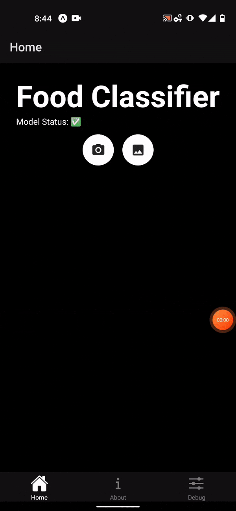

# deploying-mobile-app


## About

This is a sample template repo showing how to use tensorflow.js with react native. 

Here is the app in action.




## Assumptions

In order to use this repo, you need to have a tfjs model. You can get a smaple artifact from this repo's release. 

Please download it from this repos's release and place the contents in `assets/model_tfjs`

```
(base) deploying-mobile-app % tree assets/model_tfjs 
assets/model_tfjs
├── classes.json
├── classes.txt
├── group1-shard1of1.bin
└── model.json
```

If you want to bring in your own model, please use a command like below to convert a keras h5 artifact.

The below command converts `artifacts/model_tf_keras.h5` to  tfjs and saves it to `artifacts/model_tfjs`.

The model is also 16 bit quanitzed.   
The model is converted to `tfjs_graph_model` which is an optimized version of the graph.
The model is broken into 100MB shards.

```
pip install tensorflowjs==2.3.0

tensorflowjs_converter \
--input_format=keras \
--output_format=tfjs_graph_model \
--split_weights_by_layer \
--weight_shard_size_bytes=99999999 \ 
--quantize_float16=* \
artifacts/model_tf_keras.h5 artifacts/model_tfjs
```


## Running 


```
yarn global add expo-cli    

# you can open iOS, Android, or web from here, or run them directly with the commands below.
yarn start 

# you can open in android simulator or device driectly
yarn android 

# you can open in ios simulator or device directly
yarn ios


```


## Future

In the future, it is possible that packages may be out of date.

The below upgrade will upgrade expo and its dependencies
```
expo upgrade
```

The below command command can be used to interactively update  dependencies.

```
yarn upgrade-interactive       
```

## Other

If you are interested in a guided exploration of this content, consider Manning's Live project [Deploying a Deep Learning Model on Web and Mobile Applications
](https://www.manning.com/liveproject/deploying-a-deep-learning-model-on-web-and-mobile-applications)
